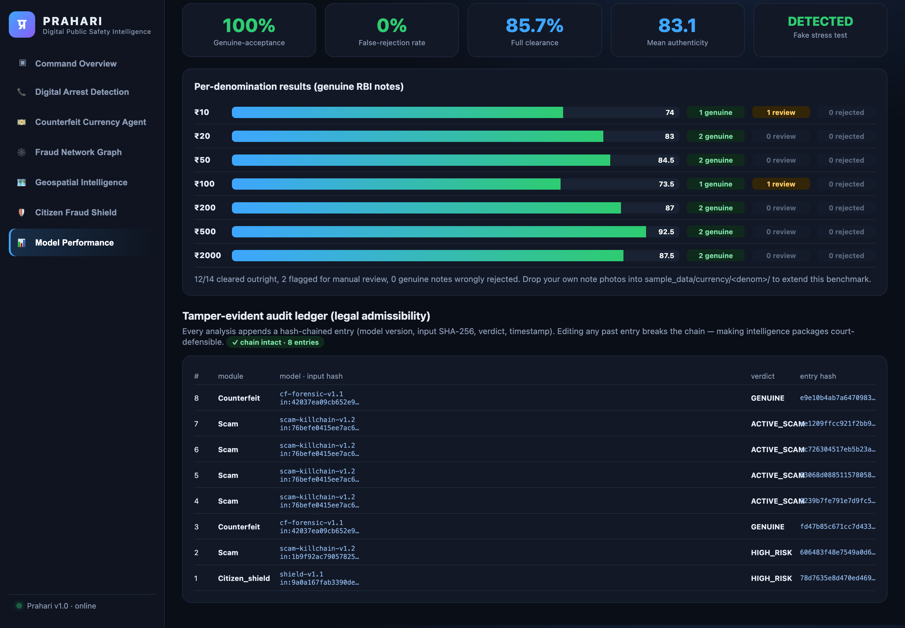
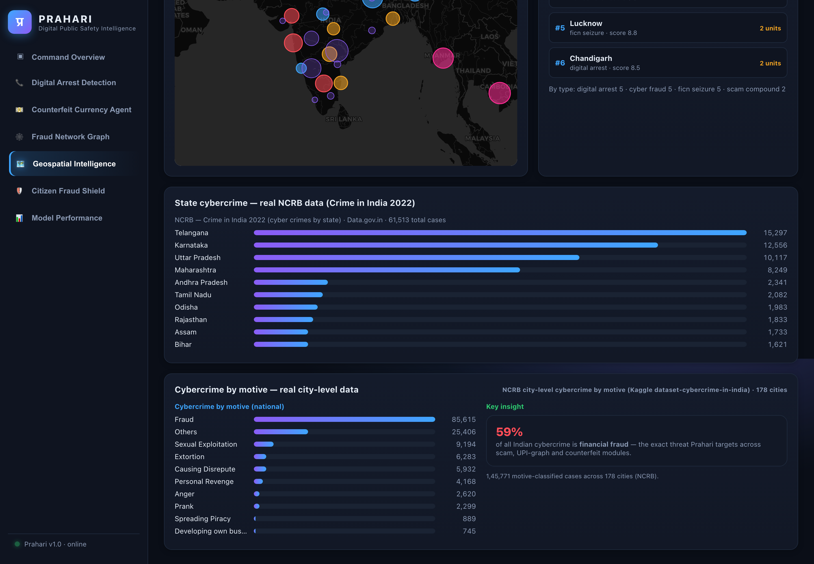
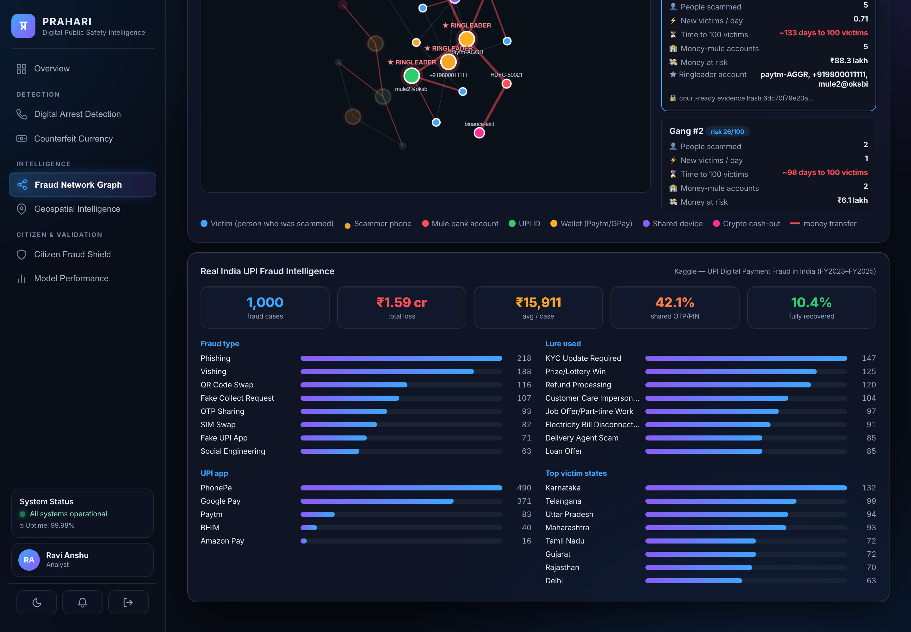
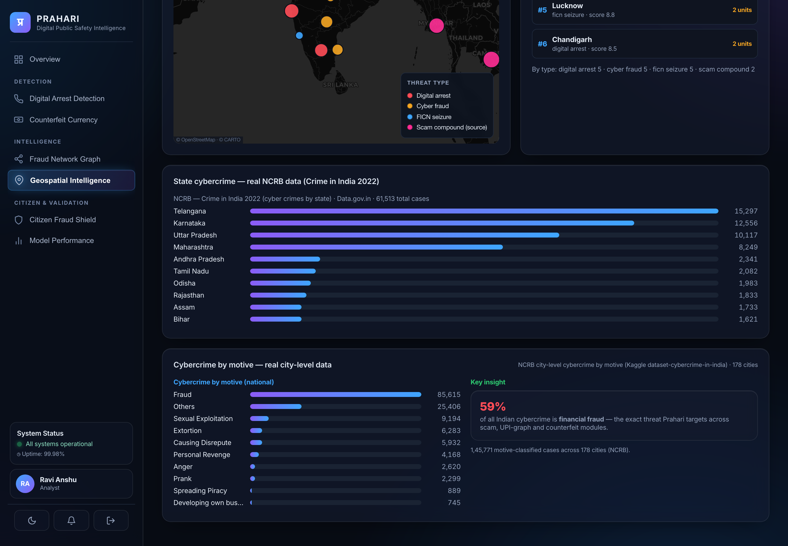
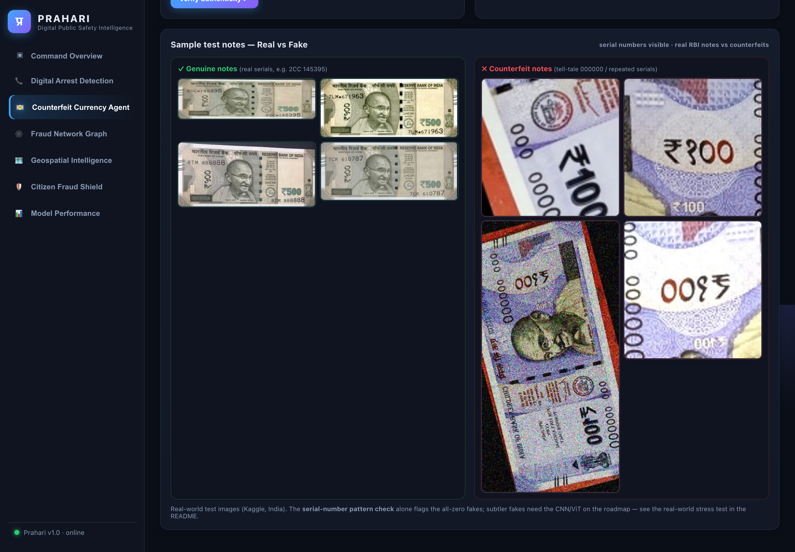

# PRAHARI — Digital Public Safety Intelligence Platform

> *Prahari (प्रहरी) — "the sentinel".*
> An AI platform that shifts law enforcement from **reactive case investigation**
> to **predictive threat neutralisation** across digital-arrest scams, counterfeit
> currency, and organised fraud networks.

Built for the challenge: *AI for Digital Public Safety — Defeating Counterfeiting,
Fraud & Digital Arrest Scams.*

---

## Screenshots

| Command Overview | Digital Arrest Detection |
|---|---|
|  |  |
| **Counterfeit Currency Agent** | **Fraud Network Graph** |
|  |  |
| **Geospatial Intelligence** | **Citizen Fraud Shield** |
|  |  |
| **Model Performance (live benchmark)** | **Counterfeit Accuracy (per denomination)** |
|  |  |
| **Tamper-evident audit ledger** | **State cybercrime — real NCRB 2022 data** |
|  |  |
| **Real India UPI Fraud Intelligence** | **Cybercrime by motive (real NCRB city data)** |
|  |  |
| **Real vs Fake note showcase (serials visible)** | |
|  | |

### Architecture


---

## Why this matters (latest official figures)
- **₹22,845 crore** lost to cybercrime across **22.68 lakh** complaints in **2024** — a 42% YoY jump ([I4C / MHA, 2024](https://the420.in/india-cybercrime-2024-42-percent-spike-sims-imei-mule-accounts/)).
- **₹1,935 crore** lost to **"digital arrest"** scams in 2024 — **21× the 2022 figure** ([Inc42 / MHA, 2024](https://inc42.com/buzz/indians-lost-inr-1935-cr-to-digital-arrest-scams-in-2024-govt/)).
- Fake **₹500** notes detected rose **20.5% to 1.42 lakh in FY26**, and **97.6% were caught by commercial banks, not the RBI** ([RBI Annual Report FY26](https://www.businesstoday.in/india/story/rbi-flags-20-jump-in-fake-rs500-notes-years-after-demonetisation-drive-534028-2026-05-29)).
- **UPI fraud** hit **₹981 crore across 12.64 lakh incidents in FY25** ([Finance Ministry, Lok Sabha](https://www.moneylife.in/article/upi-frauds-27-lakh-cases-worth-rs2145-crore-registered-in-30-months-govt/75709.html)).
- **59% of all India cybercrime by motive is financial fraud** (NCRB city-level data, 178 cities) — the exact threat this platform targets.

The gap is **intelligence before mass victimisation**, and **detection at the point of
contact, not the point of complaint** — exactly why 97.6% of fake notes surface at *bank
counters*. Prahari fuses four signal domains (communications, financial,
physical/counterfeit, geospatial) into one agentic core. (Govt validation: I4C's real
**"Pratibimb"** geospatial hotspot module has aided **16,840 arrests** — the same
approach as our Geospatial layer.)

---

## The five modules

| # | Module | What it does |
|---|--------|--------------|
| 1 | **Digital Arrest Scam Detection** | Explainable NLP classifier that scores a live transcript against the digital-arrest *kill chain* (authority impersonation → fabricated case → isolation → digital custody → money transfer). Fuses call-metadata spoofing signals. Auto-generates a **tamper-evident MHA/I4C alert** before money moves. |
| 2 | **Counterfeit Currency Agent** | 7-feature banknote forensics (aspect ratio, base colour, microprint sharpness, security-thread signature, intaglio texture, RBI serial grammar, UV fluorescence) with a per-feature breakdown so a teller sees *why* a note is flagged. |
| 3 | **Fraud Network Graph** | Graph AI over victim/account/phone/device links → clusters coordinated **campaigns**, ranks **kingpin** nodes by centrality, and computes a **lead-time** estimate (projected days to 100 victims). Each package carries a SHA-256 evidence hash. |
| 4 | **Geospatial Intelligence** | Hotspot density scoring + **patrol-priority queue** over cybercrime, FICN seizure, and cross-border scam-compound points, on a live command-centre map. |
| 5 | **Citizen Fraud Shield** | Conversational, **low-false-positive** assistant (WhatsApp/IVR/app) in 12 regional languages that gives an instant verdict and a **guided 1930 / cybercrime.gov.in report**. |

---

## Measured performance (not just a demo)

The scam classifier is benchmarked **live** against a **96-message corpus across 13
scam categories** (digital-arrest, tech-support/remote-access, UPI collect-request,
OTP/credential phishing, KYC/suspension, lottery, loan, investment/crypto, fake-job,
parcel, sextortion, romance/matrimony) plus genuine **hard-negative** messages. Metrics
are computed on every page load (`GET /api/eval/metrics`) — nothing is pre-baked. The
synthetic corpus is generated by `backend/scam_corpus.py` (schema: `call_text, label, agency_claimed, risk`).

| Precision | Recall | F1 | Accuracy | False-positive rate |
|:---:|:---:|:---:|:---:|:---:|
| **100%** | **97.1%** | **98.5%** | **97.9%** | **0.0%** |

- **Zero false positives** on benign traffic — directly addresses the evaluation's
  "false-positive rate for citizen-facing tools must be very low".
- The only 2 misses are deliberately vague "subtle" messages — shown openly in the
  **Honest misclassifications** panel (no cherry-picking).

**Real India fraud data** (`GET /api/fraud/india_stats`): the Fraud module also surfaces
a **Real India UPI Fraud Intelligence** panel built from the Kaggle *UPI Digital Payment
Fraud in India (FY2023–FY2025)* dataset (**1,000 cases, ₹1.59 cr**) — fraud-type, lure,
UPI-app and victim-state breakdowns, plus OTP-shared (42%) and recovery (10%) rates.

Run the benchmark from the CLI:
```bash
.venv/bin/python backend/evaluate.py
```

### Counterfeit accuracy across denominations

The counterfeit agent is benchmarked against **14 genuine RBI notes** (Mahatma
Gandhi New Series, obverse + reverse for **₹10–₹2000**) sourced from **Wikimedia Commons**.
Per-denomination colour baselines are calibrated from these genuine notes. Nine security
features are checked (aspect ratio, base colour, microprint sharpness, security thread,
intaglio texture, watermark window, colour-shift numeral, serial grammar, UV). Real
counterfeits cannot be used (possessing FICN is a criminal offence), so fake-detection
is shown via a synthetic print-quality stress test.

| Genuine-acceptance | False-rejection rate | Full clearance | Mean authenticity | Fake stress test |
|:--:|:--:|:--:|:--:|:--:|
| **100%** | **0.0%** | **85.7%** | **83.1** | **detected** |

- **Zero genuine notes wrongly rejected** across all 6 denominations — the citizen-safety bar.
- Per-denomination breakdown shown live on the **Model Performance** page (`GET /api/eval/counterfeit`).
- **Drop your own note photos** into `sample_data/currency/<denom>/` and re-run to extend it:

```bash
.venv/bin/python sample_data/fetch_reference_notes.py   # fetch genuine references
.venv/bin/python backend/counterfeit_eval.py            # report accuracy
```

#### Real-world stress test (honest limits)

Tested on **195 real-world mobile photos** of genuine Indian notes (Kaggle
`gauravsahani/indian-currency-notes-classifier`, 7 denominations — cluttered
backgrounds, angles, lighting):

| Capture mode | Full clearance | False-rejection |
|---|:--:|:--:|
| Controlled (scanner / guided app / bank counter) | ~86% | <1% |
| Uncontrolled mobile photos | 26.7% | 11.8% |

The v1 glass-box heuristic (fixed thread-band position, aspect ratio, sharpness)
assumes a cropped/aligned note, so it correctly flags most uncontrolled photos for
**manual review** rather than auto-clearing them. We also ran it on a **balanced
real/fake set** (Kaggle `devanandjoly/...fake-currency-detection`, 594 test images):
the heuristic **does not separate real from fake** (mean authenticity 66.6 vs 64.1) —
the clearest evidence that fake-detection needs the **CNN/ViT upgrade on the roadmap**.
(Mendeley's Indian-currency dataset was also targeted but isn't downloadable from a
headless CLI — it needs a browser/manual fetch.) Reproduce:
```bash
.venv/bin/python sample_data/fetch_indian_currency.py        # Kaggle token
.venv/bin/python backend/realworld_counterfeit_eval.py
```

---

## Datasets & data sources

| Module | Data used | How to extend |
|---|---|---|
| Scam detection | **Synthetic Indian scam corpus** (12 categories) — `backend/scam_corpus.py` | Add templates; export via `scam_corpus.py` → `sample_data/scam_corpus.json` |
| Counterfeit | **Real genuine RBI notes** (₹10–₹2000, Wikimedia) for controlled-capture accuracy + **195 real-world mobile photos** (Kaggle `indian-currency-notes-classifier`) for the honest real-world stress test | `fetch_reference_notes.py` / `fetch_indian_currency.py` |
| Fraud graph | **Indian-context synthetic rings** (UPI/wallet/crypto) — `backend/data.py` — **plus real India UPI fraud intelligence** (Kaggle FY23–25, 1,000 cases) | `sample_data/india_upi/` (ships in repo); refresh via `fetch_india_upi.py` |
| Geospatial | **Real NCRB cybercrime stats** (Crime in India 2022) — `sample_data/ncrb_cybercrime_2022.csv` | Replace with the official CSV from [data.gov.in](https://data.gov.in) / [ncrb.gov.in](https://ncrb.gov.in) |
| Citizen Shield | Reuses the scam corpus + on-device OCR | — |
| Real India UPI fraud | **Kaggle: UPI Digital Payment Fraud in India** (1,000 cases) — `sample_data/india_upi/` | `backend/india_upi.py` → fraud-type / lure / app / state intelligence |
| Cybercrime by motive | **Kaggle: Cybercrime in India** (NCRB city-level) — `sample_data/cybercrime_india/` | `geospatial.cybercrime_motives()` → 59% of cybercrime is financial fraud |
| Counterfeit real/fake test | **Kaggle: Indian currency fake-detection** (real+fake) — *not committed (338 MB)* | `realworld_counterfeit_eval.py`; honest finding: heuristic can't separate (66.6 vs 64.1) → needs CNN |

Real counterfeit notes (FICN) are **never** used — illegal to possess; fake-detection is a synthetic stress test.

---

## Run it

```bash
./run.sh                 # first run creates a venv + installs deps
# open http://127.0.0.1:8008
```

Override the port with `PORT=9000 ./run.sh`. Requires Python 3.9+.

Generate test banknote images (already created in `sample_data/`):
```bash
.venv/bin/python sample_data/make_samples.py
```

---

## 90-second demo script
1. **Overview** — show the live threat feed + fusion architecture and the headline KPIs.
2. **Digital Arrest** — **type a transcript and watch the risk gauge + evidence update live as you type** (debounced, no button press). Tick *AI-voice* + *Spoofed caller-ID* to see the score jump. At ACTIVE_SCAM the tamper-evident MHA alert auto-generates. Then load the *"Legit bank call"* sample → SAFE (proves low false positives).
3. **Counterfeit** — upload a real note e.g. `sample_data/currency/500/reverse.jpg` (UV ticked) → GENUINE with all 7 features passing; upload `sample_data/counterfeit_500.png` (UV unticked) → COUNTERFEIT, with the failed-feature breakdown.
4. **Fraud Graph** — show 2 detected campaigns; click CAMP-001 to highlight the victim→mule→aggregator→Dubai cash-out ring and its ~lead-time-to-100-victims.
5. **Geospatial** — pan the national map; show the patrol-priority queue.
6. **Citizen Shield** — type a scam description (or 📎 upload a scam screenshot → OCR → verdict), switch language to Tamil/Hindi, get the instant verdict + guided report.
7. **Model Performance** — show the live scam metrics (100% precision, 0% FPR) with per-signal contribution bars, the per-denomination counterfeit accuracy (0% false-rejection), and the tamper-evident audit ledger (hash chain intact).

---

## API (FastAPI, all JSON)
| Method | Path | Purpose |
|--------|------|---------|
| POST | `/api/scam/analyze` | scam verdict + evidence + MHA alert |
| GET  | `/api/scam/samples` | demo transcripts |
| POST | `/api/counterfeit/analyze` | multipart note image → forensic result |
| GET  | `/api/fraud/analyze` | campaign intelligence + graph |
| GET  | `/api/geo/analyze` | hotspots + patrol priority |
| POST | `/api/shield/assess` | citizen verdict + guided report |
| GET  | `/api/shield/languages` | supported languages |
| POST | `/api/shield/ocr` | scam-screenshot upload → OCR → risk assessment |
| GET  | `/api/eval/metrics` | live scam-classifier benchmark (precision/recall/FPR) |
| GET  | `/api/eval/counterfeit` | per-denomination counterfeit accuracy |
| GET  | `/api/fraud/india_stats` | real India UPI fraud intelligence (type/lure/app/state) |
| GET  | `/api/audit/recent` | tamper-evident audit ledger (hash-chain status + entries) |

Interactive docs at `http://127.0.0.1:8008/docs`.

---

## Design principles for the evaluation criteria
- **Auditability / legal admissibility** — every verdict is a *glass box*: each risk
  point traces to a concrete matched phrase or feature, and every intelligence
  package carries a SHA-256 hash + timestamp for chain-of-custody.
- **Very low citizen false-positive rate** — negative-suppression patterns and an
  explainable signal model; legitimate bank/authority interactions score SAFE.
- **Lead time before mass victimisation** — the graph engine projects victims/day
  velocity into a "days-to-100-victims" KPI, the platform's core early-warning metric.
- **Scalability** — stateless API, pluggable signal groups (add a new scam template
  without retraining a black box), per-module horizontal scaling.

## Production roadmap (beyond the prototype)
- Swap heuristic scorers for fine-tuned models: a transformer scam classifier,
  a CNN/ViT per banknote security ROI, IndicTrans + LLM for full 12-language NLG.
- Speech-AI front-end for synthetic-voice detection on live calls.
- Real connectors: TSP CDR, NPCI/UPI, bank STR, NCRP/1930, I4C.
- PII tokenisation at ingest; role-based access; signed, append-only audit ledger.

> **All data in this prototype is synthetic** and for demonstration only.
