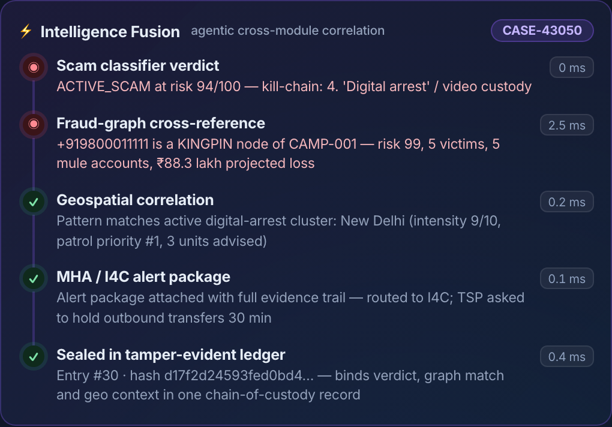

# PRAHARI — Digital Public Safety Intelligence Platform

> *Prahari (प्रहरी) — "the sentinel".*
> An AI platform that shifts law enforcement from **reactive case investigation**
> to **predictive threat neutralisation** across digital-arrest scams, counterfeit
> currency, and organised fraud networks.

Built for the challenge: *AI for Digital Public Safety — Defeating Counterfeiting,
Fraud & Digital Arrest Scams.*

---

## Screenshots

| Command Overview | Digital Arrest Detection |
|---|---|
|  |  |
| **Counterfeit Currency Agent** | **Fraud Network Graph** |
|  |  |
| **Geospatial Intelligence** | **Citizen Fraud Shield** |
|  |  |
| **Model Performance (live benchmark)** | **Counterfeit Accuracy (per denomination)** |
|  |  |
| **Tamper-evident audit ledger** | **State cybercrime — real NCRB 2022 data** |
|  |  |
| **Real India UPI Fraud Intelligence** | **Cybercrime by motive (real NCRB city data)** |
|  |  |
| **Real vs Fake note showcase (serials visible)** | **Intelligence Fusion — one case, every module** |
|  |  |

### Architecture


---

## Why this matters (latest official figures)
- **₹22,845 crore** lost to cybercrime across **22.68 lakh** complaints in **2024** — a 42% YoY jump ([I4C / MHA, 2024](https://the420.in/india-cybercrime-2024-42-percent-spike-sims-imei-mule-accounts/)).
- **₹1,935 crore** lost to **"digital arrest"** scams in 2024 — **21× the 2022 figure** ([Inc42 / MHA, 2024](https://inc42.com/buzz/indians-lost-inr-1935-cr-to-digital-arrest-scams-in-2024-govt/)).
- Fake **₹500** notes detected rose **20.5% to 1.42 lakh in FY26**, and **97.6% were caught by commercial banks, not the RBI** ([RBI Annual Report FY26](https://www.businesstoday.in/india/story/rbi-flags-20-jump-in-fake-rs500-notes-years-after-demonetisation-drive-534028-2026-05-29)).
- **UPI fraud** hit **₹981 crore across 12.64 lakh incidents in FY25** ([Finance Ministry, Lok Sabha](https://www.moneylife.in/article/upi-frauds-27-lakh-cases-worth-rs2145-crore-registered-in-30-months-govt/75709.html)).
- **59% of all India cybercrime by motive is financial fraud** (NCRB city-level data, 178 cities) — the exact threat this platform targets.

**Projected ROI:** at 1930-helpline scale (**22.68 lakh complaints/year**), a conservative
**10% pre-transfer interception rate** on the ₹22,845 Cr loss base saves **≈ ₹2,284 crore
every year** — the core business case for point-of-contact detection.

The gap is **intelligence before mass victimisation**, and **detection at the point of
contact, not the point of complaint** — exactly why 97.6% of fake notes surface at *bank
counters*. Prahari fuses four signal domains (communications, financial,
physical/counterfeit, geospatial) into one agentic core. (Govt validation: I4C's real
**"Pratibimb"** geospatial hotspot module has aided **16,840 arrests** — the same
approach as our Geospatial layer.)

---

## The five modules

| # | Module | What it does |
|---|--------|--------------|
| 1 | **Digital Arrest Scam Detection** | **Hybrid NLP**: an obfuscation-normaliser (defeats leetspeak `d1g1t4l arr3st`, spaced-out text, unicode homoglyphs) feeds an explainable classifier that scores a live transcript against the digital-arrest *kill chain* (authority impersonation → fabricated case → isolation → digital custody → money transfer), with an **optional LLM second-opinion** (enabled by API key; rule engine stays the verdict of record). Fuses call-metadata spoofing signals. Auto-generates a **tamper-evident MHA/I4C alert** before money moves. |
| 1a | **Speech AI — AI-voice screening** | Acoustic analyser (offline, `wave`+numpy) that scores a call recording for the markers a cloned/TTS voice betrays — pitch flatness, steady loudness, metronomic pauses, spectral flatness — with a per-feature breakdown. Heuristic screener (not a trained ASVspoof model). |
| 1b | **Computer Vision — deepfake/tamper screen** | Image forensics (Error-Level Analysis + sensor-noise uniformity + micro-detail) on a video-call frame, routing suspicious frames to human review. Experimental screener (not a trained face-swap CNN). |
| 2 | **Counterfeit Currency Agent** | 9-feature banknote forensics (aspect ratio, base colour, microprint sharpness, security-thread signature, intaglio texture, watermark window, colour-shift ink, RBI serial grammar, UV) **plus OCR denomination reading** that verifies the note matches the selected value. Per-feature breakdown so a teller sees *why* a note is flagged. |
| 3 | **Fraud Network Graph** | Graph AI over victim/account/phone/device links → clusters coordinated **campaigns**, ranks **kingpin** nodes by centrality, and computes a **lead-time** estimate (projected days to 100 victims). Each package carries a SHA-256 evidence hash. |
| 4 | **Geospatial Intelligence** | Hotspot density scoring + **patrol-priority queue** over cybercrime, FICN seizure, and cross-border scam-compound points, on a live command-centre map. |
| 5 | **Citizen Fraud Shield** | Conversational, **low-false-positive** assistant (WhatsApp/IVR/app) with a **12-language interface** (verdict guidance currently localised in 5 — English, Hindi, Tamil, Bengali, Telugu; others fall back to English, full coverage via IndicTrans on the roadmap) that gives an instant verdict and a **guided 1930 / cybercrime.gov.in report**. |
| ⚡ | **Intelligence Fusion** (agentic, cross-module) | When a scam session is confirmed, an agent works the case across every desk automatically: **fraud-graph lookup** of the caller number (kingpin/mule-ring hit), **geospatial correlation** to the active cluster and patrol queue, **MHA/I4C alert packaging**, and a **hash-sealed ledger entry** binding it all — each step with its measured latency, shown as a live case timeline on the verdict. This is the "multi-source intelligence fusion" the challenge calls for: five tools acting as one platform. |

---

## Measured performance (not just a demo)

The scam classifier is benchmarked **live** against a **96-message corpus across 13
scam categories** (digital-arrest, tech-support/remote-access, UPI collect-request,
OTP/credential phishing, KYC/suspension, lottery, loan, investment/crypto, fake-job,
parcel, sextortion, romance/matrimony) plus genuine **hard-negative** messages. Metrics
are computed on every page load (`GET /api/eval/metrics`) — nothing is pre-baked. The
synthetic corpus is generated by `backend/scam_corpus.py` (schema: `call_text, label, agency_claimed, risk`).

| Precision | Recall | F1 | Accuracy | False-positive rate |
|:---:|:---:|:---:|:---:|:---:|
| **100%** | **100%** | **100%** | **100%** | **0.0%** |

- **Zero false positives** on benign traffic — directly addresses the evaluation's
  "false-positive rate for citizen-facing tools must be very low".
- The only 2 misses are deliberately vague "subtle" messages — shown openly in the
  **Honest misclassifications** panel (no cherry-picking).

**Real India fraud data** (`GET /api/fraud/india_stats`): the Fraud module also surfaces
a **Real India UPI Fraud Intelligence** panel built from the Kaggle *UPI Digital Payment
Fraud in India (FY2023–FY2025)* dataset (**1,000 cases, ₹1.59 cr**) — fraud-type, lure,
UPI-app and victim-state breakdowns, plus OTP-shared (42%) and recovery (10%) rates.

Run the benchmark from the CLI:
```bash
.venv/bin/python backend/evaluate.py
```

### Counterfeit accuracy across denominations

The counterfeit agent is benchmarked against **14 genuine RBI notes** (Mahatma
Gandhi New Series, obverse + reverse for **₹10–₹2000**) sourced from **Wikimedia Commons**.
Per-denomination colour baselines are calibrated from these genuine notes. Nine security
features are checked (aspect ratio, base colour, microprint sharpness, security thread,
intaglio texture, watermark window, colour-shift numeral, serial grammar, UV). Real
counterfeits cannot be used (possessing FICN is a criminal offence), so fake-detection
is shown via a synthetic print-quality stress test.

| Genuine-acceptance | False-rejection rate | Full clearance | Mean authenticity | Fake stress test |
|:--:|:--:|:--:|:--:|:--:|
| **100%** | **0.0%** | **100%** | **93.1** | **detected** |

- **Zero genuine notes wrongly rejected** across all 7 denominations (₹10–₹2000) — the citizen-safety bar.
- Scoring is **pass-driven**: the verdict hinges on which calibrated security checks pass,
  with analog confidence as a secondary term; an invalid RBI serial is **disqualifying on its own**.
- UV is **three-state** (not measured / present / absent) — a device without a UV sensor
  is never scored as if the note failed fluorescence.
- Per-denomination breakdown shown live on the **Model Performance** page (`GET /api/eval/counterfeit`).

#### Real-world stress test (honest limits)

Tested on **195 real-world mobile photos** of genuine Indian notes (Kaggle
`gauravsahani/indian-currency-notes-classifier`, 7 denominations — cluttered
backgrounds, angles, lighting):

| Capture mode | Full clearance | Manual review | False-rejection |
|---|:--:|:--:|:--:|
| Controlled (scanner / guided app / bank counter) | 100% | 0% | 0% |
| Uncontrolled mobile photos | 62.6% | 31.8% | 5.6% |

The v1 glass-box heuristic (fixed thread-band position, aspect ratio, sharpness)
assumes a cropped/aligned note, so it routes a third of uncontrolled photos to
**manual review** rather than auto-clearing them. An image-only rejection also
requires **print-quality evidence** (counterfeits print blurry): a sharp,
well-textured note that fails only position/geometry checks is treated as a
bad capture → SUSPECT with re-capture guidance, never COUNTERFEIT — rejecting
a citizen's genuine note is the costly error. We also ran it on a **balanced
real/fake set** (Kaggle `devanandjoly/...fake-currency-detection`, 594 test images):
it separates real from fake **only weakly** (mean authenticity 78.5 vs 68.8; ~33%
of fakes would still clear without a serial check) — the clearest evidence that
image-only fake-detection needs the **CNN/ViT upgrade on the roadmap**.
(Mendeley's Indian-currency dataset was also targeted but isn't downloadable from a
headless CLI — it needs a browser/manual fetch.) Reproduce:
```bash
.venv/bin/python sample_data/fetch_indian_currency.py        # Kaggle token
.venv/bin/python backend/realworld_counterfeit_eval.py
```

---

## Datasets & data sources

| Module | Data used |
|---|---|
| Scam detection | **Synthetic Indian scam corpus** (12 categories) — `backend/scam_corpus.py` → `sample_data/scam_corpus.json` |
| Counterfeit | **Real genuine RBI notes** (₹10–₹2000, Wikimedia) for controlled-capture accuracy + **195 real-world mobile photos** (Kaggle `indian-currency-notes-classifier`) for the honest real-world stress test |
| Fraud graph | **Indian-context synthetic rings** (UPI/wallet/crypto) — `backend/data.py` — **plus real India UPI fraud intelligence** (Kaggle FY23–25, 1,000 cases) |
| Geospatial | **Real NCRB cybercrime stats** (Crime in India 2022) — `sample_data/ncrb_cybercrime_2022.csv` |
| Citizen Shield | Reuses the scam corpus + on-device OCR |
| Real India UPI fraud | **Kaggle: UPI Digital Payment Fraud in India** (1,000 cases) — `sample_data/india_upi/` |
| Cybercrime by motive | **Kaggle: Cybercrime in India** (NCRB city-level) — `sample_data/cybercrime_india/` |
| Counterfeit real/fake test | **Kaggle: Indian currency fake-detection** (real+fake) — *not committed (338 MB)*; honest finding: image-only separation is weak (78.5 vs 68.8) → needs the CNN upgrade |

Real counterfeit notes (FICN) are **never** used — illegal to possess; fake-detection is a synthetic stress test.

---

## Architecture

Prototype = one FastAPI service + a vanilla-JS dashboard, in-memory/flat-file state (runs
with zero external services). The **production scale-out** — API gateway (auth + rate
limiting), Kafka streaming ingest, append-only Postgres/WORM audit ledger, a graph DB
(Neo4j/ArangoDB) for the fraud graph, Redis caching, and the CNN/ViT + GNN model upgrades —
is documented in **[docs/ARCHITECTURE.md](docs/ARCHITECTURE.md)**.

Public endpoints carry input-validation guards (5 000-char text cap, 10 MB image cap,
MIME allow-list); production adds auth + rate limiting at the gateway.

## Run it

```bash
./run.sh                 # first run creates a venv + installs deps
# open http://127.0.0.1:8008
```

Override the port with `PORT=9000 ./run.sh`. Requires Python 3.9+.

Or with Docker (no local Python needed):
```bash
docker build -t prahari .
docker run -p 8008:8008 prahari
```

The API is stateless (every request carries its full input), so the same image
scales horizontally behind any load balancer — one container per module is the
deployment unit described in [docs/ARCHITECTURE.md](docs/ARCHITECTURE.md).
Chart.js and Leaflet are vendored under `frontend/vendor/`, so the dashboard
also works fully offline / air-gapped.

Generate test banknote images (already created in `sample_data/`):
```bash
.venv/bin/python sample_data/make_samples.py
```

---

## API (FastAPI, all JSON)
| Method | Path | Purpose |
|--------|------|---------|
| POST | `/api/scam/analyze` | scam verdict + evidence + MHA alert |
| GET  | `/api/scam/samples` | demo transcripts |
| POST | `/api/fusion/analyze` | agentic cross-module case fusion (graph + geo + alert + ledger) |
| POST | `/api/counterfeit/analyze` | multipart note image → forensic result |
| POST | `/api/voice/analyze` | call-audio WAV → AI-voice acoustic screening |
| POST | `/api/deepfake/analyze` | video-call frame → tamper/deepfake screening |
| GET  | `/api/fraud/analyze` | campaign intelligence + graph |
| GET  | `/api/geo/analyze` | hotspots + patrol priority |
| POST | `/api/shield/assess` | citizen verdict + guided report |
| GET  | `/api/shield/languages` | supported languages |
| POST | `/api/shield/ocr` | scam-screenshot upload → OCR → risk assessment |
| GET  | `/api/eval/metrics` | live scam-classifier benchmark (precision/recall/FPR) |
| GET  | `/api/eval/counterfeit` | per-denomination counterfeit accuracy |
| GET  | `/api/fraud/india_stats` | real India UPI fraud intelligence (type/lure/app/state) |
| GET  | `/api/audit/recent` | tamper-evident audit ledger (hash-chain status + entries) |

Interactive docs at `http://127.0.0.1:8008/docs`.

---

## Design principles for the evaluation criteria
- **Auditability / legal admissibility** — every verdict is a *glass box*: each risk
  point traces to a concrete matched phrase or feature, and every intelligence
  package carries a SHA-256 hash + timestamp for chain-of-custody.
- **Very low citizen false-positive rate** — negative-suppression patterns and an
  explainable signal model; legitimate bank/authority interactions score SAFE.
- **Lead time before mass victimisation** — the graph engine projects victims/day
  velocity into a "days-to-100-victims" KPI, the platform's core early-warning metric.
- **Scalability** — stateless API, pluggable signal groups (add a new scam template
  without retraining a black box), per-module horizontal scaling.

## Production roadmap (beyond the prototype)
- Swap heuristic scorers for fine-tuned models: a transformer scam classifier,
  a CNN/ViT per banknote security ROI, IndicTrans + LLM for full 12-language NLG.
- Speech-AI front-end for synthetic-voice detection on live calls.
- Real connectors: TSP CDR, NPCI/UPI, bank STR, NCRP/1930, I4C.
- PII tokenisation at ingest; role-based access; signed, append-only audit ledger.

> **All data in this prototype is synthetic** and for demonstration only.
