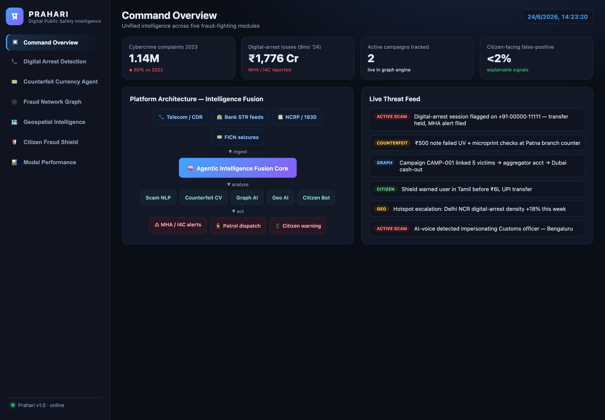
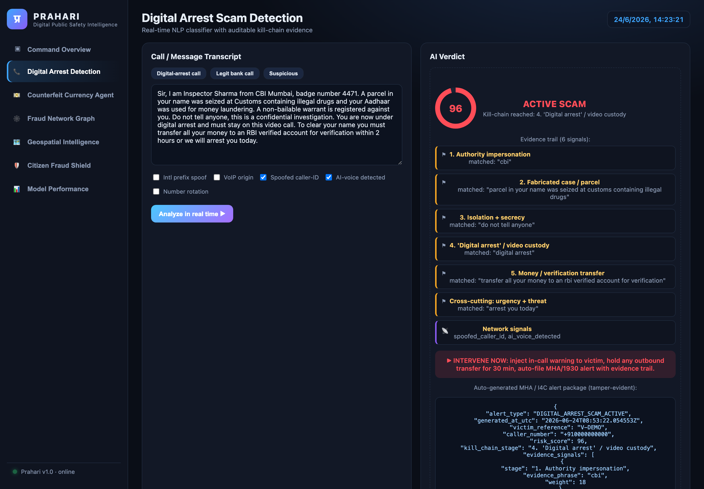
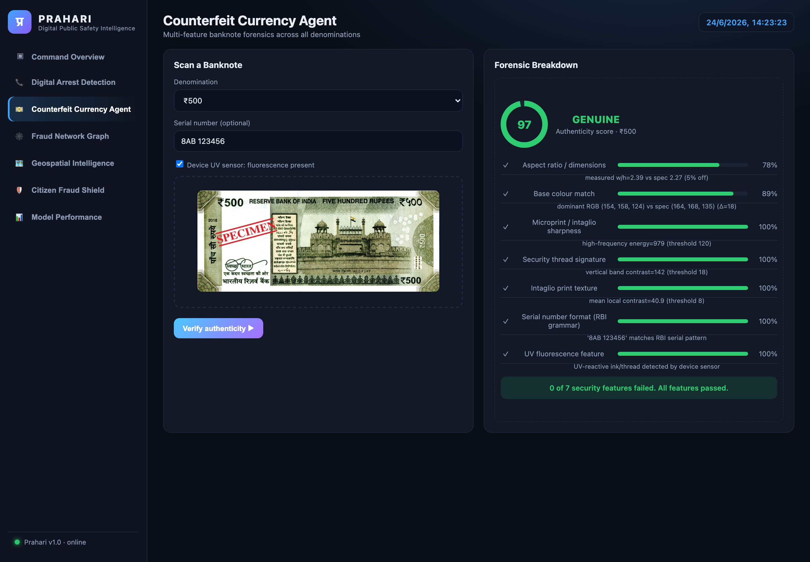
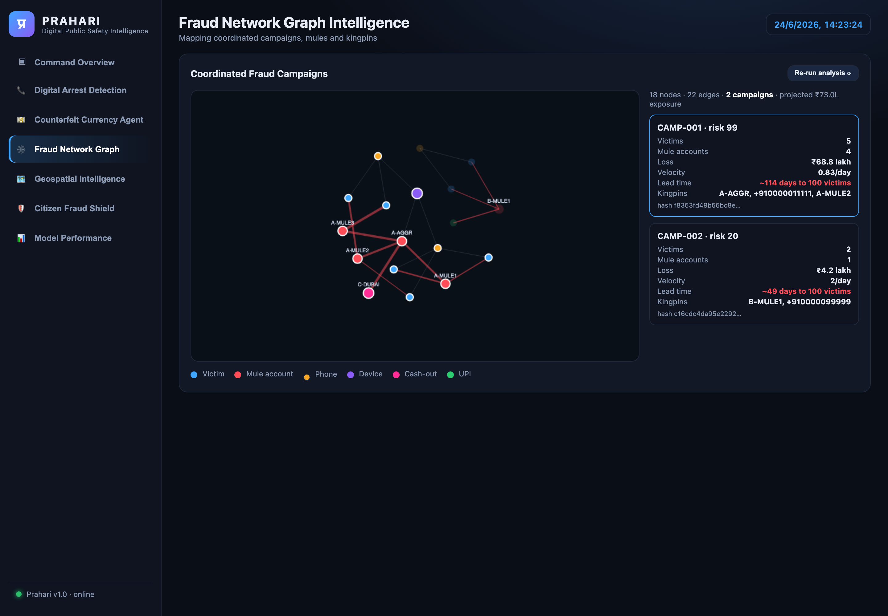
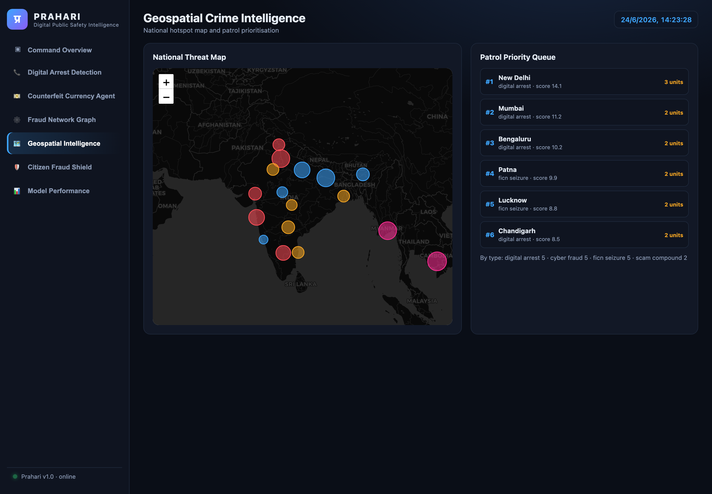
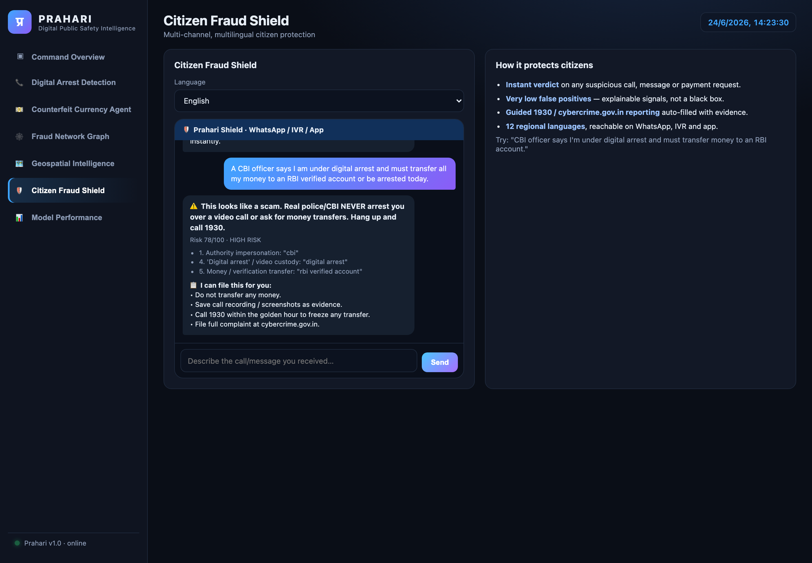
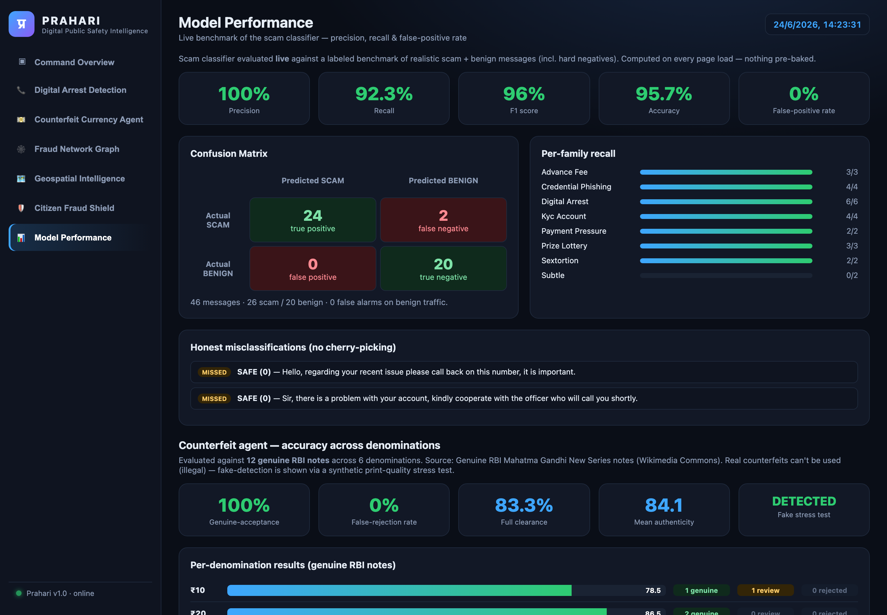
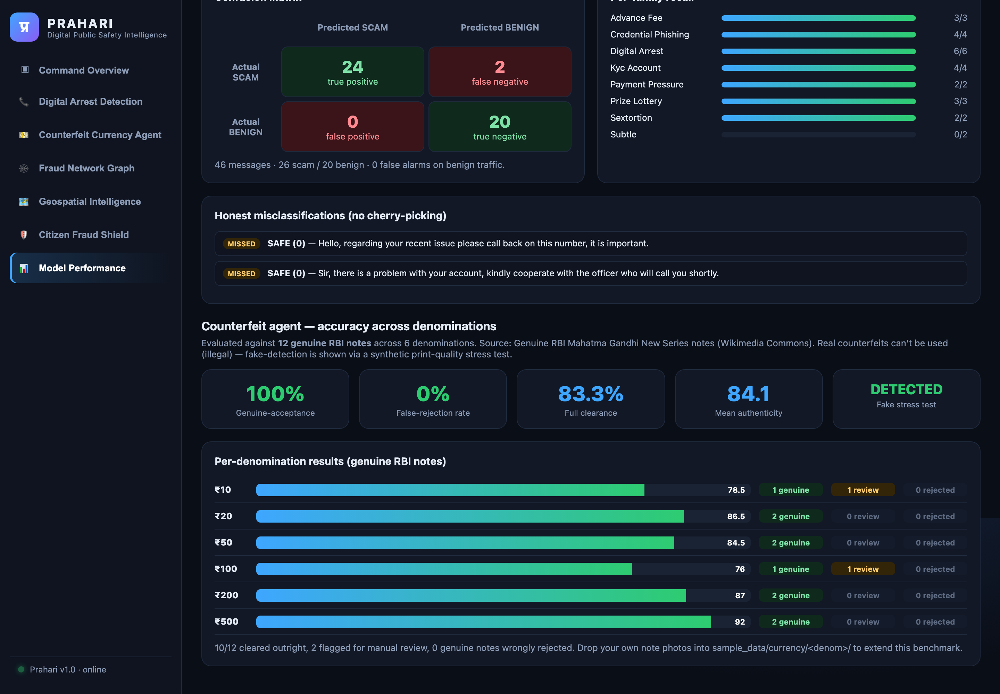
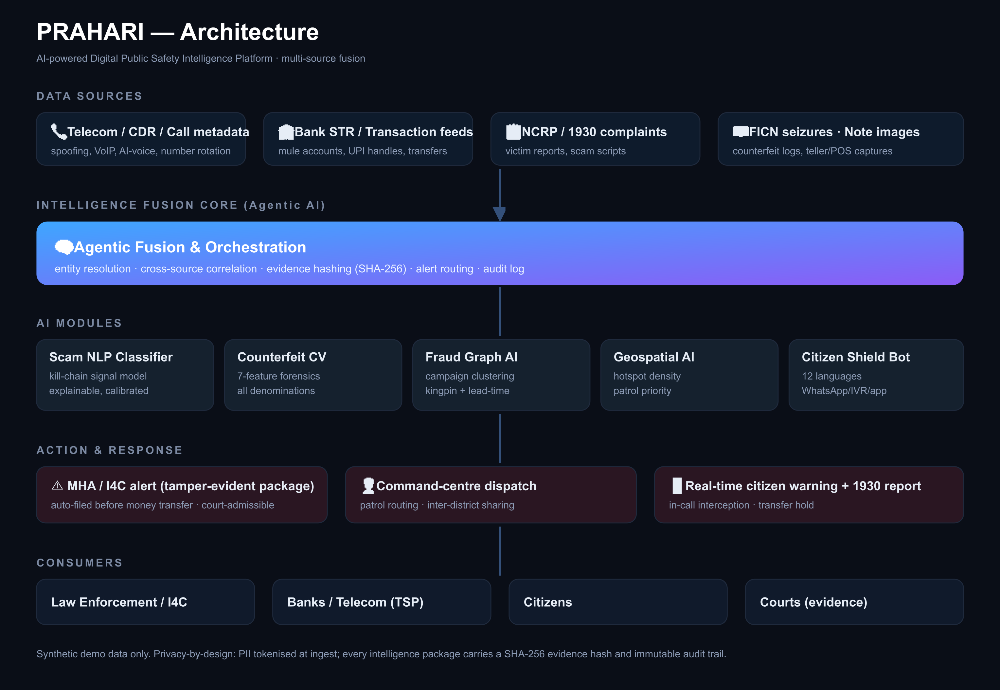

# PRAHARI — Digital Public Safety Intelligence Platform

> *Prahari (प्रहरी) — "the sentinel".*
> An AI platform that shifts law enforcement from **reactive case investigation**
> to **predictive threat neutralisation** across digital-arrest scams, counterfeit
> currency, and organised fraud networks.

Built for the challenge: *AI for Digital Public Safety — Defeating Counterfeiting,
Fraud & Digital Arrest Scams.*

---

## Screenshots

| Command Overview | Digital Arrest Detection |
|---|---|
|  |  |
| **Counterfeit Currency Agent** | **Fraud Network Graph** |
|  |  |
| **Geospatial Intelligence** | **Citizen Fraud Shield** |
|  |  |
| **Model Performance (live benchmark)** | **Counterfeit Accuracy (per denomination)** |
|  |  |

### Architecture



---

## Why this matters
- **1.14M** cybercrime complaints in India in 2023 (▲60% YoY).
- **₹1,776 crore** lost to "digital arrest" scams in just 9 months of 2024 (MHA/I4C).
- Record **FICN** (fake ₹500) seizures flagged in RBI's 2025 report.

The gap is **intelligence before mass victimisation**, and **detection at the point
of contact** — not the point of complaint. Prahari fuses four signal domains
(communications, financial, physical/counterfeit, geospatial) into one agentic core.

---

## The five modules

| # | Module | What it does |
|---|--------|--------------|
| 1 | **Digital Arrest Scam Detection** | Explainable NLP classifier that scores a live transcript against the digital-arrest *kill chain* (authority impersonation → fabricated case → isolation → digital custody → money transfer). Fuses call-metadata spoofing signals. Auto-generates a **tamper-evident MHA/I4C alert** before money moves. |
| 2 | **Counterfeit Currency Agent** | 7-feature banknote forensics (aspect ratio, base colour, microprint sharpness, security-thread signature, intaglio texture, RBI serial grammar, UV fluorescence) with a per-feature breakdown so a teller sees *why* a note is flagged. |
| 3 | **Fraud Network Graph** | Graph AI over victim/account/phone/device links → clusters coordinated **campaigns**, ranks **kingpin** nodes by centrality, and computes a **lead-time** estimate (projected days to 100 victims). Each package carries a SHA-256 evidence hash. |
| 4 | **Geospatial Intelligence** | Hotspot density scoring + **patrol-priority queue** over cybercrime, FICN seizure, and cross-border scam-compound points, on a live command-centre map. |
| 5 | **Citizen Fraud Shield** | Conversational, **low-false-positive** assistant (WhatsApp/IVR/app) in 12 regional languages that gives an instant verdict and a **guided 1930 / cybercrime.gov.in report**. |

---

## Measured performance (not just a demo)

The scam classifier is benchmarked **live** against a labeled set of realistic scam
messages (digital-arrest, OTP/credential phishing, KYC/suspension, lottery, loan/refund,
sextortion, utility) plus genuine **hard-negative** messages. Metrics are computed on
every page load (`GET /api/eval/metrics`) — nothing is pre-baked.

| Precision | Recall | F1 | Accuracy | False-positive rate |
|:---:|:---:|:---:|:---:|:---:|
| **100%** | **92.3%** | **96.0%** | **95.7%** | **0.0%** |

- **Zero false positives** on benign traffic — directly addresses the evaluation's
  "false-positive rate for citizen-facing tools must be very low".
- The only 2 misses are deliberately vague "subtle" messages — shown openly in the
  **Honest misclassifications** panel (no cherry-picking).

Run the benchmark from the CLI:
```bash
.venv/bin/python backend/evaluate.py
```

### Counterfeit accuracy across denominations

The counterfeit agent is benchmarked against **12 genuine RBI notes** (Mahatma
Gandhi New Series, obverse + reverse for ₹10–₹500) sourced from **Wikimedia Commons**.
Per-denomination colour baselines are calibrated from these genuine notes. Real
counterfeits cannot be used (possessing FICN is a criminal offence), so fake-detection
is shown via a synthetic print-quality stress test.

| Genuine-acceptance | False-rejection rate | Full clearance | Mean authenticity | Fake stress test |
|:--:|:--:|:--:|:--:|:--:|
| **100%** | **0.0%** | **83.3%** | **84.1** | **detected** |

- **Zero genuine notes wrongly rejected** across all 6 denominations — the citizen-safety bar.
- Per-denomination breakdown shown live on the **Model Performance** page (`GET /api/eval/counterfeit`).
- **Drop your own note photos** into `sample_data/currency/<denom>/` and re-run to extend it:

```bash
.venv/bin/python sample_data/fetch_reference_notes.py   # fetch genuine references
.venv/bin/python backend/counterfeit_eval.py            # report accuracy
```

---

## Run it

```bash
./run.sh                 # first run creates a venv + installs deps
# open http://127.0.0.1:8008
```

Override the port with `PORT=9000 ./run.sh`. Requires Python 3.9+.

Generate test banknote images (already created in `sample_data/`):
```bash
.venv/bin/python sample_data/make_samples.py
```

---

## 90-second demo script
1. **Overview** — show the live threat feed + fusion architecture and the headline KPIs.
2. **Digital Arrest** — click *"Digital-arrest call"* sample, tick *AI-voice* + *Spoofed caller-ID*, **Analyze**. Show the 90+ risk score, the kill-chain evidence trail, and the auto-generated tamper-evident MHA alert. Then click the *"Legit bank call"* sample → SAFE (proves low false positives).
3. **Counterfeit** — upload a real note e.g. `sample_data/currency/500/reverse.jpg` (UV ticked) → GENUINE with all 7 features passing; upload `sample_data/counterfeit_500.png` (UV unticked) → COUNTERFEIT, with the failed-feature breakdown.
4. **Fraud Graph** — show 2 detected campaigns; click CAMP-001 to highlight the victim→mule→aggregator→Dubai cash-out ring and its ~lead-time-to-100-victims.
5. **Geospatial** — pan the national map; show the patrol-priority queue.
6. **Citizen Shield** — type a scam description, switch language to Tamil/Hindi, get the instant verdict + guided report.
7. **Model Performance** — show the live scam metrics (100% precision, 0% FPR) and the per-denomination counterfeit accuracy (0% false-rejection).

---

## API (FastAPI, all JSON)
| Method | Path | Purpose |
|--------|------|---------|
| POST | `/api/scam/analyze` | scam verdict + evidence + MHA alert |
| GET  | `/api/scam/samples` | demo transcripts |
| POST | `/api/counterfeit/analyze` | multipart note image → forensic result |
| GET  | `/api/fraud/analyze` | campaign intelligence + graph |
| GET  | `/api/geo/analyze` | hotspots + patrol priority |
| POST | `/api/shield/assess` | citizen verdict + guided report |
| GET  | `/api/shield/languages` | supported languages |
| GET  | `/api/eval/metrics` | live scam-classifier benchmark (precision/recall/FPR) |
| GET  | `/api/eval/counterfeit` | per-denomination counterfeit accuracy |

Interactive docs at `http://127.0.0.1:8008/docs`.

---

## Design principles for the evaluation criteria
- **Auditability / legal admissibility** — every verdict is a *glass box*: each risk
  point traces to a concrete matched phrase or feature, and every intelligence
  package carries a SHA-256 hash + timestamp for chain-of-custody.
- **Very low citizen false-positive rate** — negative-suppression patterns and an
  explainable signal model; legitimate bank/authority interactions score SAFE.
- **Lead time before mass victimisation** — the graph engine projects victims/day
  velocity into a "days-to-100-victims" KPI, the platform's core early-warning metric.
- **Scalability** — stateless API, pluggable signal groups (add a new scam template
  without retraining a black box), per-module horizontal scaling.

## Production roadmap (beyond the prototype)
- Swap heuristic scorers for fine-tuned models: a transformer scam classifier,
  a CNN/ViT per banknote security ROI, IndicTrans + LLM for full 12-language NLG.
- Speech-AI front-end for synthetic-voice detection on live calls.
- Real connectors: TSP CDR, NPCI/UPI, bank STR, NCRP/1930, I4C.
- PII tokenisation at ingest; role-based access; signed, append-only audit ledger.

> **All data in this prototype is synthetic** and for demonstration only.
